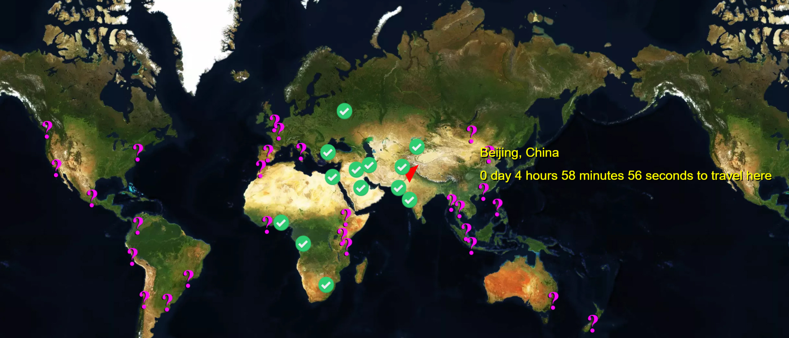
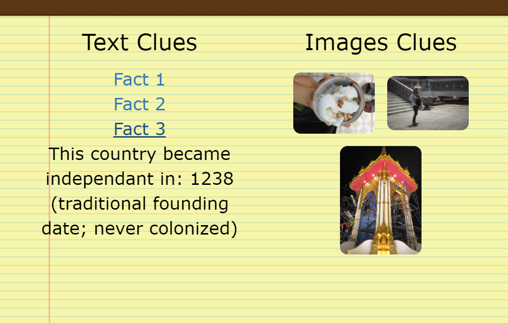
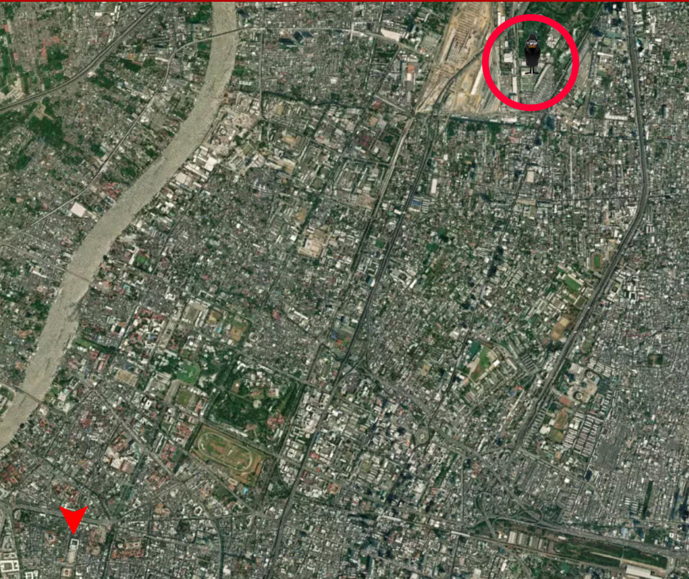

# Carlos San Francisco

A web game inspired by Carmen Sandiego using JavaScript and Firebase.  The user must use clues given to them in the form of pictures taken around the world (Flickr API) and various facts given to them (CIA world fact book API) to try and track down the criminal on the world map before time runs out.  

## Getting Started

Clone or download the files for local use and you are good to go!

## Built With...

* [Flickr](https://www.flickr.com/services/api/) 
* [CIA world Fact Book](https://www.cia.gov/library/publications/the-world-factbook/)
* [Javascript](https://www.javascript.com/)
* [MapBox](https://www.mapbox.com/)

## Authors

* **Tyler Finkle** - *MapBox, Modals, Factbook API, gifs, MATH and bits and bobs* - (https://github.com/carltheape)
* **Ray Shin** - *Firebase and bits and bobs* - (https://github.com/rayjshin)
* **James Littlefield** - *Front End Designs, Timer and bits and bobs* - (https://github.com/musicteachj)
* **Meguel Chavez** - *Flickr API, Clues and bobs* - (https://github.com/mc4tech)

## Acknowledgments
**Thanks to Flickr, Mapbox, and GA TECH!**
**Try it [HERE](https://carltheape.github.io/carlosSanFrancisco/)**

* Built for GA tech coding bootcamp
